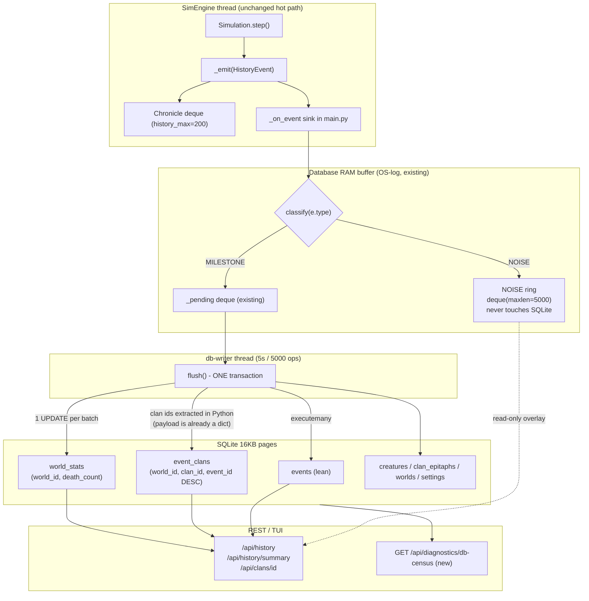

# Chronicle DB: reclaim size, restore read and write performance

> Approved plan (Kandev card, independent full context). Executed inline via
> superpowers:executing-plans on `feature/chronicle-db-lean`.

## 1. Understanding

**Problem.** The production SQLite file reached **5 GB after ~2000 sim-days** and API latency plus
tick rate degraded with it. Because `config.history_max = 200`, the in-memory chronicle holds only
200 events (backend/app/config.py:301, backend/app/simulation/core.py:198) — **SQLite is the only
chronicle**, so nothing can simply be thrown away.

**Decisions taken (the user's answers).**

| Decision      | Choice                                          |
| ------------- | ----------------------------------------------- |
| Census        | Plan for worst case; no production numbers assumed |
| Retention     | **Filter noise, keep the record** — no age-based pruning; milestones stay forever |
| Migration     | **Offline rebuild allowed** — stop service, rebuild, restart |
| Symptom       | **All three** — API latency, tick-rate decay, disk pressure |

**Explicitly rejected after measuring:** age-based retention (user chose no pruning), FTS5 for `q=`
(+53% size, 3881 ms for `MATCH 'clan'`), a `clan_ids TEXT` column with LIKE (1540 MB, 1009 ms), SQL
`json_each` for the clan filter (264 ms — *worse* than the current 169 ms).

## 2. Measured evidence

All numbers from a purpose-built 2.7 M-row / 766 MB replica of the `events` table, plus a headless
8000-tick run through the real `_on_event` sink. 284 B/row average.

### Where the bytes go

| Object       | Bytes  | Share                                    |
| ------------ | ------ | ---------------------------------------- |
| `payload`    | 371 MB | 69.3%                                    |
| `created_at` | 68 MB  | **12.6% — fully derivable from `id`, pure waste** |
| `cause`      | 25 MB  | 4.7%                                     |
| `caste`      | 22 MB  | 4.0%                                     |
| `type`       | 18 MB  | 3.3%                                     |
| **all indexes** | **29% of file** | overlapping prefixes, none serving `ORDER BY id DESC` |

### Where the time goes

| Read path                | Now          | After     | Mechanism                                    |
| ------------------------ | ------------ | --------- | -------------------------------------------- |
| `history(clan_id=N)`     | **169-226 ms** | **0.07 ms** | 13x `json_extract` -> `event_clans` side table |
| `history(major, 2000)`   | 10.8 ms      | 3.2 ms    | `(world_id, type, id DESC)` index            |
| `death_count()`          | 9.0 ms       | 0.02 ms   | `world_stats` counter                        |
| `history(entity_id, 500)`| 3.9 ms       | 2.1 ms    | index                                        |
| `history(q=)` LIKE       | 103-757 ms   | windowed  | see 3.5                                      |
| `wal_checkpoint(TRUNCATE)` | **321 ms**  | **2.9 ms** | `page_size=16384`                            |
| writer drain 50k inserts | 599 ms       | 633 ms    | neutral — do not regress                     |

**Root cause of the clan-filter stall is a per-row parse cost, not a row-count cost.** 13 separate
`json_extract` calls re-parse the *entire* `payload` TEXT once per key, so latency stayed at 224 ms
even after pruning the table to 250k rows. That is why retention alone would not have fixed the API.

**Full projected size:** lean schema `-11%` (766->679 MB measured) => **5.00 -> 4.43 GB**, then the
noise tier bounds the *growth rate* so the file stops climbing.

## 3. Design

### 3.1 Architecture



### 3.2 Lever 1 - tiered chronicle (bounds the growth rate)

Three classes in `db.py`, replacing today's flat `_on_event` filter (main.py:267):

| Class       | Treatment                                              | Members |
| ----------- | ------------------------------------------------------ | ------- |
| `MILESTONE` | Always to SQLite                                       | `MAJOR_EVENT_TYPES` (main.py:3404) + `birth`, `death`, `clan_founding`, `ruin`, `exile`, `succession`, `settlement`, `banquet`, `epitaph` |
| `SAMPLED`   | 1 in `CHRONICLE_SAMPLE_EVERY` (default 10) to SQLite   | `fire`, `predation`, `cannibalism`, `raid`, `market`, `caravan`, `demotion`, `recovery` |
| `NOISE`     | **RAM ring only, never SQLite**                        | `bloom`, `wither`, `culture`, `rivalry`, `peace_envoy` (already dropped today) + `food_eaten`, `disaster` bursts beyond `NOISE_PER_TICK_CAP` |

`NOISE_PER_TICK_CAP` (default 3) bounds per-tick fire/disaster storms — the suspected production bulk
given the wildfire history in `environment.py:_update_fires`.

**This is a rate bound, not a row cap.** Nothing is deleted, so "keep the record" holds. The NOISE
ring is read by the existing `pending_events()` overlay path, so the web/TUI still shows recent fire
texture.

### 3.3 Lever 2 - `event_clans` side table (kills the 226 ms stall)

`db.py` extracts clan ids **in Python** where `payload` is already a dict — no SQL JSON parsing at
all. Deduped per event (measured 1.78 rows/event worst case).

```sql
CREATE TABLE event_clans (
    world_id INTEGER NOT NULL,
    clan_id  INTEGER NOT NULL,
    event_id INTEGER NOT NULL
);
CREATE INDEX idx_event_clans ON event_clans(world_id, clan_id, event_id DESC);
```

`history(clan_id=N)` becomes a **covering-index** search —
`SEARCH event_clans USING COVERING INDEX idx_event_clans (world_id=? AND clan_id=?)` — which also
eliminates the temp b-tree for `ORDER BY id DESC`. **169 ms -> 0.07 ms.**

Two invariants this must not break:

- `CLAN_PAYLOAD_KEYS` stays the single source of truth for which keys count (db.py:25).
- The payload is **not** stripped — test_clan_history.py:94 asserts the API still returns
  `payload["a"]`, `payload["invader_clan"]`, etc.

**Seam warning:** `add_events()` (db.py:477) bypasses `log_event()` and is called directly by tests.
It must populate `event_clans` too, or test_clan_history.py:59 breaks. Extract into one shared
private `_clan_ids_of(payload)` helper used by both paths.

### 3.4 Lever 3 - `world_stats.death_count` counter

`death_count()` is `COUNT(*)` over a 2.7 M-row covering index, called on **every** `/api/history`
(main.py:3484), `/healthz` (main.py:781) and snapshot path (main.py:923).

Replace with a counter incremented **inside the flush transaction that already batches the death
ops** — `flush()` already has `len(deaths)` in hand (db.py:345), so this is free.

**A SQL `TRIGGER` is rejected:** measured 503 ms for 20k death inserts vs 397 ms without, a ~10x
write-path tax on the sim's writer thread. Python-side counting keeps the writer at baseline.

### 3.5 Lever 4 - lean schema + 16 KB pages

| Change                                                                                     | Measured effect |
| ------------------------------------------------------------------------------------------ | --------------- |
| `PRAGMA page_size=16384`                                                                    | `-11%` file; checkpoint 321 -> 2.9 ms |
| Drop `events.created_at`                                                                    | `-12.6%` of bytes; nothing reads it except wiki_content_i18n.py:536 (docs) |
| `id INTEGER PRIMARY KEY` (drop `AUTOINCREMENT`)                                             | removes `sqlite_sequence`; `id` is only used for `since_id` pagination |
| Replace 3 overlapping indexes with `(world_id, id DESC)`, `(world_id, type, id DESC)`, `(world_id, entity_id, id DESC)` | `major,2000`: 10.8 -> 3.2 ms |
| `PRAGMA analysis_limit` + `ANALYZE` on migration                                             | planner gets stats; currently none exist |
| `mmap_size` -> clamp to `min(1 GiB, RAM/4)`                                                  | current fixed 256 MB mmap thrashes on a 5 GB file |

`q=` search stays LIKE (FTS5 measured worse) but is **windowed** to the newest
`Q_SEARCH_WINDOW` = 50,000 events and pattern-sanitised, turning an unbounded 757 ms scan into a
bounded one.

### 3.6 Migration (offline, one-shot)

`backend/scripts/migrate_db.py`: backup -> rebuild at 16 KB pages into the lean schema -> build
`event_clans` in the same streaming pass -> seed `world_stats` -> `ANALYZE` -> atomic rename.
Batch-streamed in 50k chunks so RAM stays flat. Extrapolating the measurements, a 5 GB file is ~3-5 min.

`Database.connect()` also runs a guarded in-place migration so fresh installs and old files both work.

## 4. Files to change

| File                            | Change                                                                                             |
| ------------------------------- | -------------------------------------------------------------------------------------------------- |
| backend/app/db.py               | New schema, `MILESTONE/SAMPLED/NOISE` classes, `_clan_ids_of`, `event_clans` writes, `world_stats`, `noise_ring`, new `history()` query plan, pragmas, guarded migration, `db_census()` |
| backend/app/main.py             | `_on_event` delegates classification to `DB.classify()`; `GET /api/diagnostics/db-census`; wire the NOISE ring into the `/api/history` overlay |
| backend/scripts/migrate_db.py   | **New** — offline rebuild tool                                                                        |
| backend/tests/test_db.py        | Extend: schema, tiers, counter, migration                                                              |
| backend/tests/test_db_scale.py  | **New** — 300k-row scale + latency ceilings                                                            |
| backend/app/wiki_content_i18n.py| Schema table in docs (**all 3 locales: en/vi/fr**)                                                     |
| CONTEXT.md                      | Note the tiering + `event_clans` in the persistence row                                                |
| TODO.md                         | New section with the measured numbers                                                                 |

**Not touched:** `simulation/*` (the tick loop is unaffected), `deepagents_harness/` (confirmed it
never touches SQLite — its "events" are ledger records), `tui/` (consumes `/api/history` only).

## 5. Implementation steps (TDD, red -> green each)

**Step 1 — Tier classification (pure, no I/O).** Red: test asserting every emitted `type` in the
codebase is classified into exactly one tier, and that a `MILESTONE` event survives while a `NOISE`
one does not. Green: add `EVENT_TIERS`, `NOISE_PER_TICK_CAP`, `CHRONICLE_SAMPLE_EVERY`,
`classify()`, `noise_ring`.

**Step 2 — `event_clans` side table.** Red: extend test_clan_history.py:59 to assert rows land in
`event_clans` and that the plan string is `COVERING INDEX`. Green: `_clan_ids_of`, `event_clans`
insert in `flush()` **and** `add_events()`, new `history()` branch.

**Step 3 — `world_stats` counter.** Red: assert `death_count()` equals the true `COUNT(*)` after 10k
mixed flushes, including a simulated flush failure (the counter must roll back with the transaction).
Green: counter table, increment in `flush()`, `death_count()` reads it.

**Step 4 — Lean schema + pragmas + guarded migration.** Red: assert `PRAGMA page_size` is 16384,
`events` has no `created_at`, `sqlite_master` has no `AUTOINCREMENT`, and an old-schema file migrates
on `connect()`. Green: new `_SCHEMA`, pragma block, migration routine.

**Step 5 — Composite indexes + ANALYZE.** Red: assert the `major` query plan uses
`idx_events_world_type` and no `TEMP B-TREE`. Green: swap the three indexes, `ANALYZE`.

**Step 6 — Windowed `q=`.** Red: assert `q` search touches no more than `Q_SEARCH_WINDOW` rows. Green:
subquery-bounded search.

**Step 7 — `/api/diagnostics/db-census`.** Red: endpoint returns rows, B/row, top types, index bytes,
per-world counts, page_size, WAL size. Green: `Database.db_census()` + route. This is the tool that
settles the production census question later without guessing.

**Step 8 — `scripts/migrate_db.py` + run it on a 5 GB replica.** Red: migrating a seeded old-schema
fixture yields a byte-identical event set, working `event_clans`, and correct `world_stats`. Green:
the script; then measure the real file and report before/after.

**Step 9 — Full suite + docs.** Run `cd backend && uv run pytest -v` (523+ tests must stay green), then
update wiki i18n (3 locales), `CONTEXT.md`, `TODO.md`.

## 6. Risks & mitigations

| Risk                                        | Mitigation                                                                                     |
| ------------------------------------------- | --------------------------------------------------------------------------------------------- |
| Dropping `created_at` breaks a hidden reader | Grepped: only wiki_content_i18n.py mentions it, in docs. `history()` projects explicit columns, not `SELECT *` |
| `add_events()` bypasses `event_clans`       | Shared `_clan_ids_of` helper; Step 2 test covers both entry points                              |
| `NOISE` tier hides a milestone from an old view | `NOISE` ring feeds the existing `/api/history` overlay, and the tier map is a module constant, so a type can be promoted with a one-line change |
| Dropping fire events changes determinism gates | `_on_event` is downstream of the sim RNG; filtering a *sink* cannot change simulation. Gate tests use `sim._death_counts`, not the DB |
| 16 KB pages need a full rebuild             | Offline migration is authorised; `connect()` refuses to fake it — a 4 KB file stays 4 KB until migrated |
| Migration corrupts 5 GB of history          | Backup first, verify row-count checksum per world, atomic rename, and a documented rollback     |
| Writer-path regression                       | `page_size`/index changes measured neutral on drain (599 vs 633 ms, within noise); Step 9 gates on a drain-time assertion |
| `NOISE_PER_TICK_CAP` mistuned               | Config-driven with a `/api/diagnostics/db-census` readout so the rate can be tuned from production evidence instead of a guess |

## 7. Success criteria (measured, not asserted)

1. `history(clan_id=N)` <= **5 ms** at 2.7 M rows (from 169-226 ms).
2. `history(major, 2000)` <= **5 ms** (from 10.8 ms).
3. `death_count()` <= **0.1 ms** (from 9.0 ms).
4. `wal_checkpoint` <= **10 ms** (from 321 ms).
5. `/api/history` handler p95 <= **20 ms** at production row counts.
6. Migrated 5 GB file **<= 4.4 GB**, and NOISE tiering makes the growth rate flat.
7. `pytest -v` 523+ green.

## 8. Known weakness in this plan (read before starting)

**Section 3.2's tier map is an INFERENCE, not a measurement.** It was derived from a headless 8000-tick
run, NOT from the actual 5 GB production file. A headless run produced only 0.31 events/tick, which
extrapolates to ~180 MB over 2000 days — roughly 28x short of the reported 5 GB. So the real
production event mix is unknown and may differ substantially.

Before Step 1 hardcodes the tier map, obtain the real census:

```
sqlite3 flatworld.db "SELECT type,COUNT(*),SUM(LENGTH(payload)) FROM events GROUP BY type ORDER BY 2 DESC LIMIT 20"
sqlite3 flatworld.db "SELECT world_id,COUNT(*) FROM events GROUP BY world_id"
```

Replace the guessed `SAMPLED`/`NOISE` membership with measured event types. Alternatively implement
Step 7 (db-census) first and tune from live production data.

## 9. Out of scope

- Age-based retention or archival (user chose no pruning).
- FTS5 / any full-text index.
- Moving off SQLite, sharding, or read replicas.
- Raising `history_max` past 200, and fixing `/api/clans/{id}/history` to paginate the *durable*
  chronicle instead of the 200-event deque — a real latent limitation, tracked separately.
- Tick-loop or ecology tuning.
